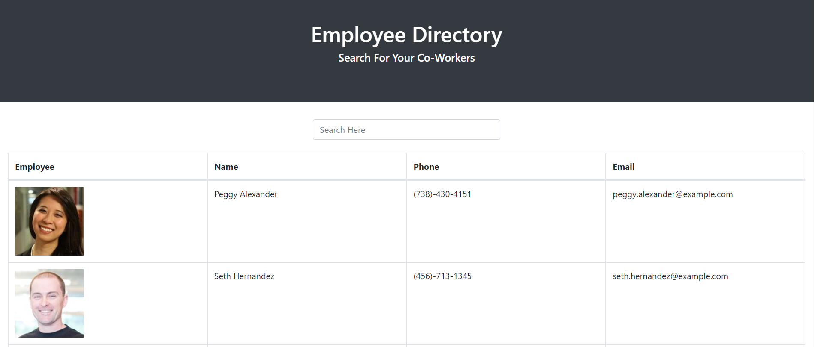

# Employee_Directory

# Table of Contents
* [Description](#description)
* [User_Story](#user_story)
* [Github_Links](#github_links)
* [Email_Address](#email_address)
* [Project_Images](#project_images)

# Description

View an entire employee directory at once so that you have quick access to their information

# User_Story

Get to know your employees/co-workers with this directory that provides basic contact infomation
and pictures of the staff...to avoid the awkward watercooler encounter where you know their face, 
but not their name.  

# Github_links

https://joewills615.github.io/Employee_Directory/

https://github.com/JoeWills615/Employee_Directory

# Email_Address

JoeWills615@gmail.com

# Project_Images

 

  
  

 